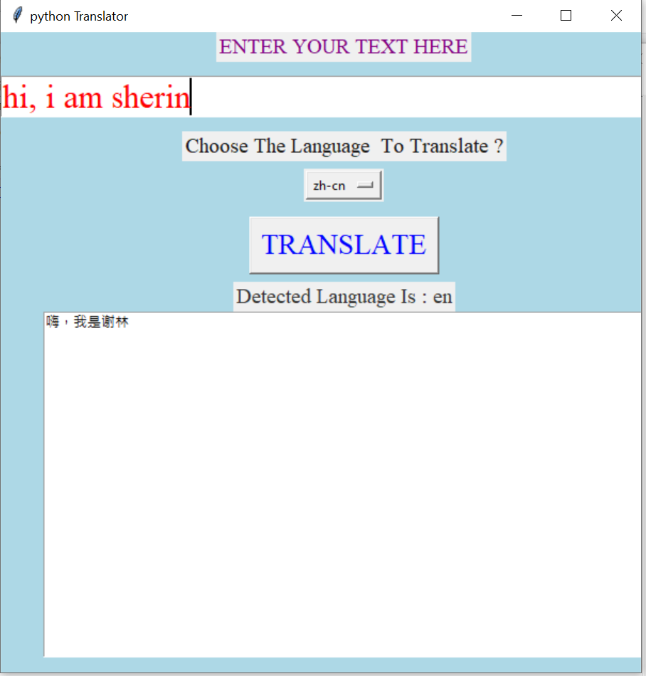

# Python--Text-Translator
Its a basic text translator written in python language using gui, where user can enter input of any language and get the desired output according to user's desire.
The gui has be created using tkinter library of python and translation of the input is done by googletrans library of python.
Googletrans is a free and unlimited python library that implemented Google Translate API. This uses the Google Translate Ajax API to make calls to such methods as detect and translate.

  
  

